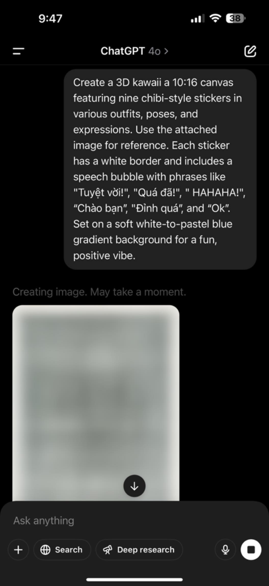

# Tạo sticker của bản thân

[https://www.facebook.com/share/p/1Yf9umkqGg/](https://www.facebook.com/share/p/1Yf9umkqGg/)

Bước 1: vào chatGPT up một tấm ảnh kèm prompt bên dưới. Lưu ý có thể đổi các câu khẩu hiệu tuỳ sở thích của ĐB, chatGPT sẽ lấy đó để tạo sticker tương ứng
\
Create a 3D kawaii a 10:16 canvas featuring nine chibi-style stickers in various outfits, poses, and expressions. Use the attached image for reference. Each sticker has a white border and includes a speech bubble with phrases like "Tuyệt vời!", "Quá đã!", " HAHAHA!", “Chào bạn”, "Đỉnh quá”, and “Ok”. Set on a soft white-to-pastel blue gradient background for a fun, positive vibe.


\

Bước 2: Save ảnh được tạo bởi chatGPT xuống Photos.
\
Bước 3: Nhấn giữ vào sticker, sẽ có lựa chọn Add Sticker, bấm vào đó rồi chọn các hiệu ứng cho sticker, xong rồi thì bấm Done/Xong. Tới đây là sticker đã có thể sử dụng cho các app như Facebook, WhatsApp… rồi

<figure><figcaption></figcaption></figure>

<figure><figcaption></figcaption></figure>

<figure><figcaption></figcaption></figure>

<figure><figcaption></figcaption></figure>

Bước 4: Lặp lại Bước 3 cho các sticker còn lại hoặc sticker nào thích.
\
Chúc ĐB có bộ sticker độc đáo của riêng mình để chia sẻ với bạn bè…
