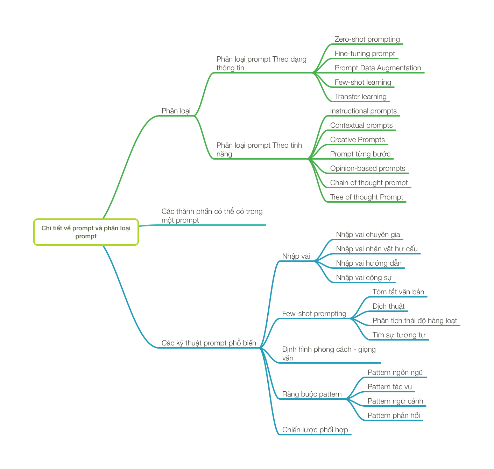
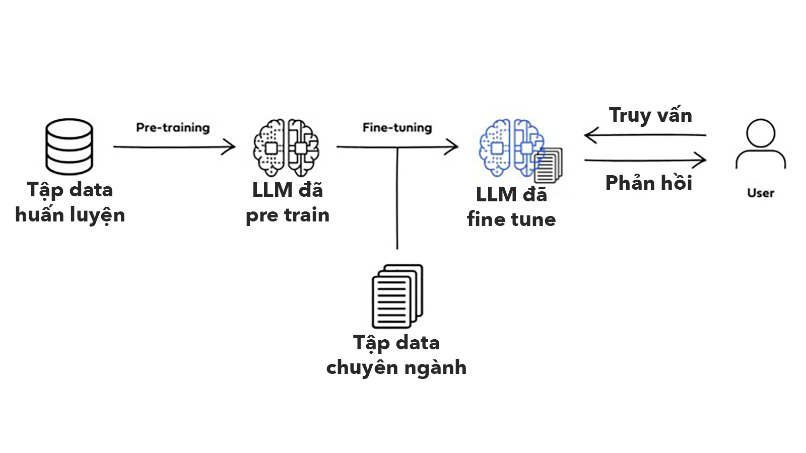
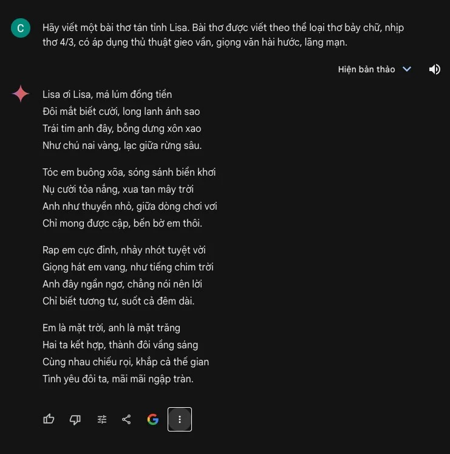
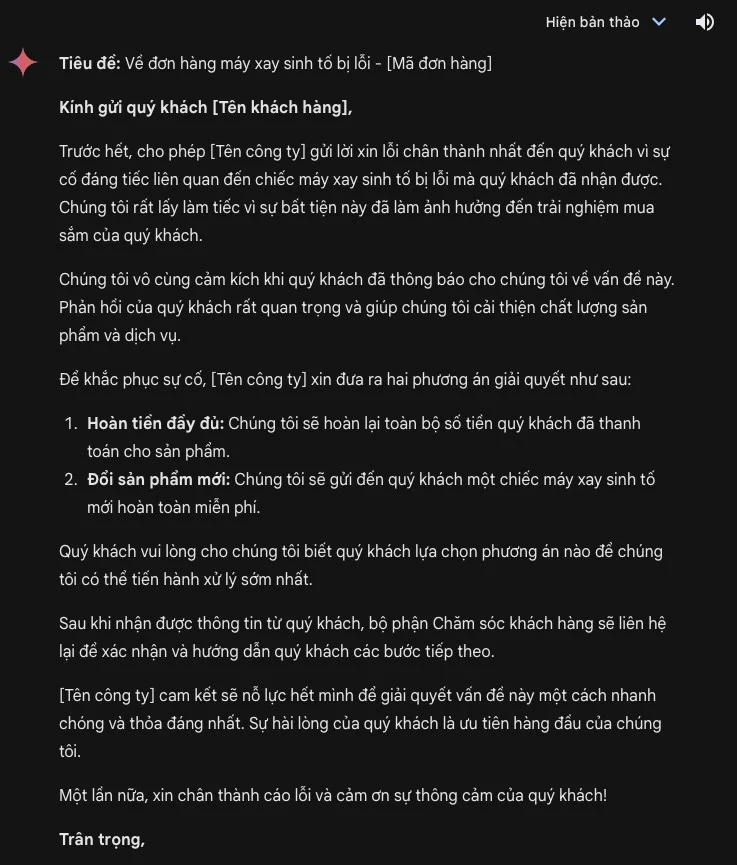
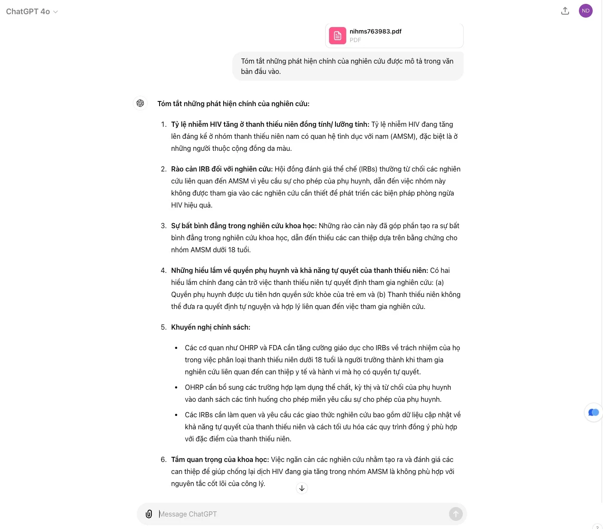
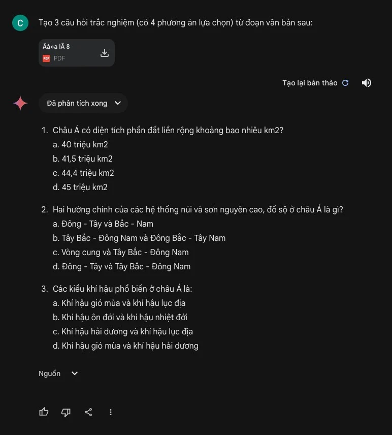
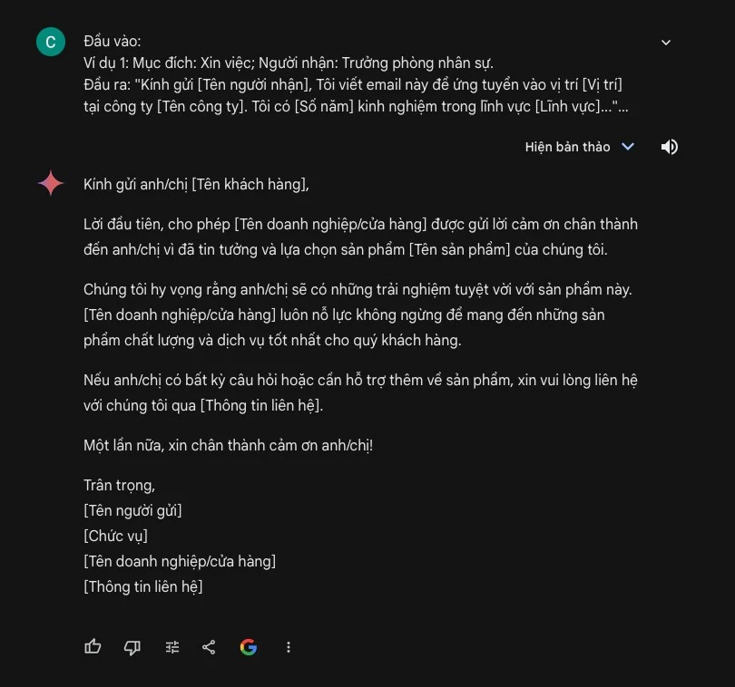
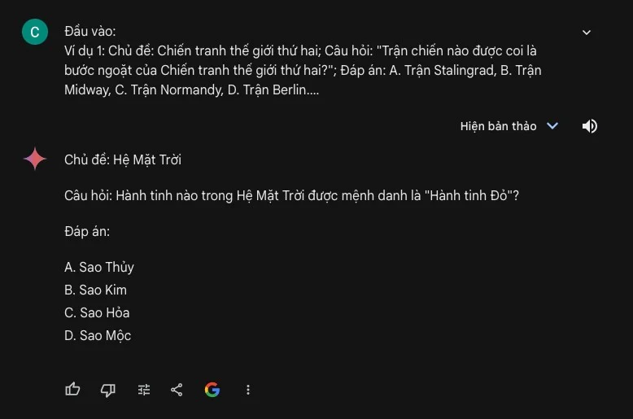

# Cùng học GenAI Phần 2: Chi tiết về Prompt, cách một LLM chạy, phân loại prompt theo dạng thông tin

<figure><figcaption></figcaption></figure>

[Prompt](https://tinhte.vn/tag/prompt) là cách con người giao tiếp với LLM, bắt nó làm các nhiệm vụ để phục vụ mục đích của người dùng. Từ các tác vụ cơ bản như tạo chữ / tạo hình ảnh với nhiều cấp độ phức tạp khác nhau, rồi suy luận logic, brainstorm, giải quyết các trình tự, trích xuất dữ liệu, làm các tác vụ lặp đi lặp lại, làm biểu mẫu hàng loạt, cho tới những nhu cầu cao cấp hơn như tạo Code, làm việc tự động,… đều xuất phát từ việc con người dùng prompt để giao tiếp với LLM.\
\
Ở phần 2 của chuỗi bài này, mình sẽ tập trung vào prompt, các dạng prompt, các thành phần của prompt và cả hướng tới việc hoàn thiện các kỹ thuật của prompt engineering. Sau khi nắm được các prompt này, chúng ta sẽ có thể tự tin áp dụng liền khi xài với các dịch vụ như ChatGPT, Gemini, Perplexity hay Copilot để giải quyết các nhu cầu của chúng ta ngay lập tức. Sau đó thì mình sẽ chia sẻ với anh em nhiều hơn về các use case cụ thể và hướng tới việc tự huấn luyện, rồi tạo RAG, tạo cả chat bot riêng và cả sâu hơn về cách các thuật toán nó chạy trong não của LLM nữa nha.\
\
Anh em nên tham khảo lại Phần 1 của chuỗi bài này để dễ nắm hơn nhe.\

1. [Cùng học GenAI Phần 1: Các khái niệm cơ bản về GenAI, LLM, cách hoạt động, train, các giới hạn,…](https://tinhte.vn/thread/cung-hoc-genai-phan-1-cac-khai-niem-co-ban-ve-genai-llm-cach-hoat-dong-train-cac-gioi-han.3801144/)

### Prompt

<figure><figcaption></figcaption></figure>

Hồi xưa giờ, những phần mềm mà con người tạo ra và sử dụng, đều hoạt động theo kiểu if / else, nghĩa là nếu người dùng A thì máy sẽ dịch sang ngôn ngữ máy, máy chạy và trả về kết quả B. Cặp A/B này được các nhà phát triển tính toán sẵn, cứ vậy mà làm. Tuy nhiên, LLM ra đời, người dùng nhập A, máy tính sẽ "suy luận" và tạo ra cái mà anh dev không soạn sẵn.\
\
Khi xưa, khi sử dụng máy tính, từ việc thao tác với hệ điều hành, cho tới các ứng dụng cụ thể đó phục vụ cho công việc, như Word, Excel hay Photoshop, Premiere,... thì chúng ta sẽ chọn qua các menu, các phím tắt trong giao diện mà nhà phát triển soạn sẵn cho chúng ta. Đối với các ứng dụng Gen [AI](https://tinhte.vn/tag/ai) sử dụng LLM, thì chúng ta có một công cụ tương ứng là câu lệnh hay các prompt. Các prompt này được viết bằng ngôn ngữ tự nhiên của con người (có thể bằng tiếng Anh, tiếng Việt hay các ngôn ngữ khác).\
\
Prompt gần như là cách duy nhất, phổ biến nhất để chúng ta sử dụng các ứng dụng GenAI. Từ việc tạo ra ảnh bằng Stable Diffusion, kêu chatbot ChatGPT hay Gemini trả kiến thức hoặc làm việc gì đó, rồi chỉnh sửa ảnh trong Photoshop,.... tất cả đều hoạt động bằng prompt. Dựa vào Prompt thì LLM mới hiểu được chúng ta cần gì và trả về kết quả đúng ý chúng ta muốn.\
\
Và hồi xưa, chúng ta cũng cần phải học mới có thể sử dụng được phần mềm, phải thuộc vị trí của các menu trong Word, phải thuộc các hàm Excel, phải nhớ trình tự các bước để chỉnh sửa bức ảnh trong Photoshop theo một mục đích nào dó,... thì bây giờ chúng ta cũng cần nắm được cấu trúc của một câu prompt đơn giản để khai thác các sức mạnh của LLM phục vụ cho chúng ta.\
\

### Prompt Engineering

<figure><figcaption></figcaption></figure>

\
Có nhiều cấp độ sử dụng Prompt, tương ứng với các tác vụ từ căn bản (tìm nhanh thông tin, dịch, tóm tắt, tạo nhanh văn bản,...) cho tới chuyên sâu, phục vụ các nhu cầu cực kỳ đặc biệt và đặc thù mà AI có thể giúp được cho công việc. Ở cấp độ sử dụng cơ bản, chúng ta chỉ cần một vài công thức prompt căn bản, đơn giản là có thể sử dụng các chatbot AI nhằm tiết kiệm thời gian so với cách làm truyền thống.\
\
Đối với những nhu cầu sử dụng chuyên sâu, phức tạp hơn, Gen AI có thể được tận dụng để thay thế một phần những công việc chuyên môn của mỗi người. Thí dụ có thể tạo chatbot chăm sóc khách hàng, chatbot nhận thông tin từ khách hàng và báo giá - chốt đơn nhanh mà không cần con người, gia sư hỗ trợ tự học, giáo viên, luật sư,...\
\
Đối với các cách tiếp cận này, cần có kiến thức chuyên sâu hơn gọi là Prompt Engineering. Kiến thức ở đây đòi hỏi hiểu được các khía cạnh của LLM, các ưu / nhược điểm của nó, có hiểu biết về ngôn ngữ, khoa học nhận thức và có thể hiểu được cấu trúc, workflow của các công việc chuyên môn đặc thù, sau đó dùng Gen AI để cải thiện trải nghiệm người dùng. Mục đích là tận dụng tối đa sức mạnh của Gen AI để tiết kiệm thời gian, cải thiện hiệu quả công việc.\
Điều gì xảy ra khi chúng ta nhập một prompt vào cho LLM

<figure><figcaption></figcaption></figure>

Chỗ này mình nhắc lại xíu về cách một prompt nó chạy cho dễ tiếp các phần dưới hau. Khi LLM đã được training xong, nó sẽ được triển khai cho người dùng xài, sẵn sàng tạo ra kết quả khi người dùng nhập prompt vào.\
\
Khi người dùng nhập một prompt vào, prompt đó sẽ được đưa vào trong mạng neural của LLM. Trong "bộ não" của LLM sẽ có các thành phần đặc biệt của để xử lý và phân tích yêu cầu của người dùng.\
\
Việc đầu tiên, những câu văn của người dùng sẽ được băm ra thành các vector theo dạng \[23, 435, 54, 985.12,...].\
\
Tiếp theo, một thành phần trong LLM sẽ đi xác định xem trong câu prompt người dùng nhập vào, đâu là những từ quan trọng. Cái này tương tự như cách chúng ta dò những từ quan trọng khi đang đọc một đoạn văn bản vậy.\
\
Một thành phần khác sẽ có nhiệm vụ ghi nhớ thứ tự và vị trí của những từ trong câu prompt của người dùng. Những thông tin này sẽ được dùng để LLM xác định ngữ cảnh của cuộc hội thoại.\
\
Tiếp theo, một thành phần khác trong LLM sẽ đảm nhận trách nhiệm tạo ra một danh sách những từ có thể sẽ xuất hiện trong phản hồi. Mỗi từ trong danh sách này sẽ được gán một điểm xác suất, xác suất này càng lớn thì tỷ lệ xuất hiện trong câu phản hồi của AI càng cao.\
\
Tiếp theo, LLM sẽ sử dụng một kỹ thuật gọi là decoding để chọn các lựa chọn mà nó cho là hợp lý nhất và ghép nó lại thành một phản hồi hoàn chỉnh. Trong quá trình này, LLM có thể chọn những từ có xác suất cao nhất trong danh sách "Có thể xuất hiện trong phản hồi", cũng có thể nó sẽ chọn ngẫu nhiên một vài từ để tạo ra các câu trả lời ít bị trùng lặp nhất có thể và nghe có vẻ giống con người hơn.\
\
Tóm lại, khi người dùng nhập prompt vào, sau khi prompt được token hóa, kiến trúc bộ não của LLM sẽ xác định từ quan trọng để tập trung vào, nhớ thứ tự và vị trí của các từ trong câu, lập danh sách xác suất các từ có thể xuất hiện trong câu trả lời, một số thì chọn ngẫu nhiên, một số quan trọng thì chọn xác suất cao nhất và cuối cùng là cho ra câu trả lời. Quá trình này tạo ra kết quả cuối cùng là một câu trả lời, sau đó là một cuộc hội thoại nối tiếp có vẻ rất giống với cách con người nói chuyện với nhau.\
\
Một trong những điểm mạnh của LLM chính là nó có thể học theo kiểu few-shot và zero-shot. Cụ thể, nó có thể tạo ra kiến thức từ giai đoạn pre-training và sau đó nhanh chóng thích ứng với những tác vụ hoặc lĩnh vực mới với lượng dữ liệu đào tạo bổ sung không nhiều.\

* Đối với học theo kiểu few-shot, người ta chỉ cần cho model một lượng nhỏ các thí dụ để nó học và nó sẽ có được kiến thức mới dể hoàn thành nhiệm vụ mà trước đó nó chưa được học.
* Đối với học kiểu zero-shot, model sẽ chỉ dựa vào kiến thức có sẵn và prompt để tạo ra câu trả lời.

\
Hai cách học nói trên của LLM sẽ dẫn tới 2 kiểu prompt phổ biến và từ đó, phát triển ra thành rất nhiều hình thái prompt khác để tận dụng tối đa sức mạnh của LLM.\
\
Mặc dù có vai trò rất quan trọng, nhưng không phải lúc nào prompt cũng sẽ mang lại kết quả hoàn hảo ngay từ lần đầu truy vấn model. Nguyên nhân là đầu ra của model còn phụ thuộc vào nhiều yếu tố khác nhau, chẳng hạn như chất lượng của dữ liệu được đào tạo sẵn và khả năng khái quát hóa kiến thức của model. Tuy nhiên, prompt đóng vai trò cực kỳ quan trọng đối với bất kỳ ứng dụng GenAI nào. Việc dùng đúng prompt sẽ giúp người dùng tương tác với model hiệu quả hơn ở rất nhiều ứng dụng và lĩnh vực chuyên môn.\
\
Trong các bài về prompt này, mình sẽ đưa các prompt thí dụ vào box và in đậm, còn phản hồi của LLM in nghiêng cho anh em dễ hình dung nha.\
\

### Chi tiết về prompt và phân loại prompt

\
Ở phần tiếp theo, chúng ta sẽ tìm hiểu các thành phần cơ bản của một prompt, phân loại các kiểu prompt, các yếu tố bổ sung vào một prompt,... để có thể có ứng dụng vào nhu cầu cụ thể thực tế nhằm khai thác tối đa sức mạnh của LLM.\
\
Thông qua việc làm chủ các [kỹ thuật prompt](https://tinhte.vn/tag/ky-thuat-prompt) khác nhau và vai trò của chúng trong việc tương tác với LLM, chúng ta sẽ có thể nắm được hầu hết các kỹ thuật prompt engineering cơ bản.\
\
Đồng thời, phần tiếp theo chúng ta cũng sẽ thử biết thêm cách yêu cầu ngữ điệu, đóng vai của AI nhằm tạo ra phản hồi hiệu quả, hấp dẫn hơn. Cơ bản thì hết loạt này, coi như các bạn đã có thể nắm được hầu hết các kỹ thuật prompt và có thể tự tin hơn để ra lệnh cho ChatGPT, Gemini hay Copilot làm việc cho bạn.\
\
Các prompt để giao tiếp với LLM có thể được phân loại dựa trên các khía cạnh như mục đích, định dạng và các chi tiết chứa bên trong nó. Bên dưới đây là một số các dạng prompt căn bản.\
\

### Phân loại prompt theo dạng thông tin

\

### Zero-shot prompting

\
Đây là một kỹ thuật bắt LLM tạo ra những phản hồi với những tác vụ mà nó chưa được huấn luyện chuyên biệt. Ở kỹ thuật này, người dùng sẽ nhập vào LLM prompt miêu tả cái mà họ muốn ở phản hồi đầu ra. Tất cả đều được viết dưới dạng ngôn ngữ tự nhiên. LLM sẽ sử dụng kiến thức sẵn có của nó để tạo ra phản hồi dựa theo yêu cầu của prompt.\
\
Thí dụ 1: Chúng ta muốn yêu cầu LLM viết một bài thơ về tình yêu để tán em Lisa\
Prompt:\
Hãy viết một bài thơ tán tỉnh Lisa. Bài thơ được viết theo thể loại thơ bảy chữ, nhịp thơ 4/3, có áp dụng thủ thuật gieo vần, giọng văn hài hước, lãng mạn.Phản hồi\
\
`Lisa ơi Lisa, má lúm đồng tiền`\
`Đôi mắt biết cười, long lanh ánh sao`\
`Trái tim anh đây, bỗng dưng xôn xao`\
`Như chú nai vàng, lạc giữa rừng sâu.`\
\
`Tóc em buông xõa, sóng sánh biển khơi`\
`Nụ cười tỏa nắng, xua tan mây trời`\
`Anh như thuyền nhỏ, giữa dòng chơi vơi`\
`Chỉ mong được cập, bến bờ em thôi.`\
\
`Rap em cực đỉnh, nhảy nhót tuyệt vời`\
`Giọng hát em vang, như tiếng chim trời`\
`Anh đây ngẩn ngơ, chẳng nói nên lời`\
`Chỉ biết tương tư, suốt cả đêm dài.`\
\
`Em là mặt trời, anh là mặt trăng`\
`Hai ta kết hợp, thành đôi vầng sáng`\
`Cùng nhau chiếu rọi, khắp cả thế gian`\
`Tình yêu đôi ta, mãi mãi ngập tràn.`

<figure><figcaption></figcaption></figure>

Thí dụ 2: Yêu cầu LLM viết một email mẫu phản hồi các phàn nàn của khách hàng về chất lượng sản phẩm\
Prompt:\
`Viết một email trả lời khách hàng phàn nàn về việc nhận được sản phẩm bị lỗi. Email cần bao gồm các yếu tố sau:`\
`* Xin lỗi vì sự bất tiện`\
`* Cảm ơn khách hàng đã phản hồi`\
`* Đề nghị giải pháp (hoàn tiền hoặc gửi sản phẩm mới)`\
`* Thông báo các bước tiếp theo`\
`* Thể hiện mong muốn khách hàng hài lòng`\
`Email của khách hàng: "Kính gửi [Tên công ty],`\
\
`Tôi đã đặt hàng một chiếc máy xay sinh tố từ trang web của các bạn tuần trước. Khi nhận được hàng, tôi rất thất vọng khi thấy sản phẩm bị nứt ở phần đế. Tôi đã rất mong chờ được sử dụng sản phẩm này và giờ cảm thấy rất bực bội. Tôi hy vọng các bạn có thể giải quyết vấn đề này nhanh chóng."`\
Phản hồi:

<figure><figcaption></figcaption></figure>

### Fine-tuning prompt

\
Dạng prompt này thường được dùng khi người dùng đưa một tập dữ liệu vào và hỏi LLM thông tin trong đó. Bản chất của việc đưa dữ liệu vào (một file text, bảng tính, hình ảnh,...) chính là train thêm cho LLM một lượng nhỏ dữ liệu và sau đó bắt nó làm một nhiệm vụ gì đó.\
\
Thí dụ 1: trong tình huống này, mình thử tải một nghiên cứu về tỷ lệ nhiễm HIV của giới trẻ đồng tính và đặt câu hỏi:\
Prompt:\
`Tóm tắt những phát hiện chính của nghiên cứu được mô tả trong văn bản đầu vào.`\
Và kết quả đầu ra do model LLM trả về:\
`**Tóm tắt những phát hiện chính của nghiên cứu:**`\
\
`1. **Tỷ lệ nhiễm HIV tăng ở thanh thiếu niên đồng tính/ lưỡng tính:** Tỷ lệ nhiễm HIV đang tăng lên đáng kể ở nhóm thanh thiếu niên nam có quan hệ tình dục với nam (AMSM), đặc biệt là ở những người thuộc cộng đồng da màu.`\
\
`2. **Rào cản IRB đối với nghiên cứu:** Hội đồng đánh giá thể chế (IRBs) thường từ chối các nghiên cứu liên quan đến AMSM vì yêu cầu sự cho phép của phụ huynh, dẫn đến việc nhóm này không được tham gia vào các nghiên cứu cần thiết để phát triển các biện pháp phòng ngừa HIV hiệu quả.`\
\
`3. **Sự bất bình đẳng trong nghiên cứu khoa học:** Những rào cản này đã góp phần tạo ra sự bất bình đẳng trong nghiên cứu khoa học, dẫn đến thiếu các can thiệp dựa trên bằng chứng cho nhóm AMSM dưới 18 tuổi.`\
\
`4. **Những hiểu lầm về quyền phụ huynh và khả năng tự quyết của thanh thiếu niên:** Có hai hiểu lầm chính đang cản trở việc thanh thiếu niên tự quyết định tham gia nghiên cứu: (a) Quyền phụ huynh được ưu tiên hơn quyền sức khỏe của trẻ em và (b) Thanh thiếu niên không thể đưa ra quyết định tự nguyện và hợp lý liên quan đến việc tham gia nghiên cứu.`\
\
`5. **Khuyến nghị chính sách:**`\
`- Các cơ quan như OHRP và FDA cần tăng cường giáo dục cho IRBs về trách nhiệm của họ trong việc phân loại thanh thiếu niên dưới 18 tuổi là người trưởng thành khi tham gia nghiên cứu liên quan đến can thiệp y tế và hành vi mà họ có quyền tự quyết.`\
`- OHRP cần bổ sung các trường hợp lạm dụng thể chất, kỳ thị và từ chối của phụ huynh vào danh sách các tình huống cho phép miễn yêu cầu sự cho phép của phụ huynh.`\
`- Các IRBs cần làm quen và yêu cầu các giao thức nghiên cứu bao gồm dữ liệu cập nhật về khả năng tự quyết của thanh thiếu niên và cách tối ưu hóa các quy trình đồng ý phù hợp với đặc điểm của thanh thiếu niên.`\
\
`6. **Tầm quan trọng của khoa học:** Việc ngăn cản các nghiên cứu nhằm tạo ra và đánh giá các can thiệp để giúp chống lại dịch HIV đang gia tăng trong nhóm AMSM là không phù hợp với nguyên tắc cốt lõi của công lý.Thí dụ 2: Tình huống một giáo viên đang muốn tạo bộ đề trắc nghiệm kiểm tra kiến thức của học sinh lớp 8. Giáo viên đã “dạy thêm” cho LLM bằng cách chuẩn bị sẵn toàn bộ các văn bản trong sách giáo khoa Toán, Lý, Hóa, Sinh, Văn, Sử, Địa,… chứa kiến thức cần soạn câu trắc nghiệm.`\
Prompt\
`Tạo 3 câu hỏi trắc nghiệm (có 4 phương án lựa chọn) từ đoạn văn bản sau:`

<figure><figcaption></figcaption></figure>

Phản hồi:\

<figure><figcaption></figcaption></figure>

### Prompt Data Augmentation

\
Đây là một kỹ thuật để tăng cường hiệu suất của LLM. Cách làm là tạo ra các biến thể khác nhau của một prompt gốc ban đầu để model có thể linh hoạt và mạnh mẽ hơn trong việc hiểu và phản hồi các input khác nhau. Mục đích của việc này là giúp mô hình học được các cách diễn đạt khác nhau của cùng một ý nghĩa, từ đó cải thiện khả năng hiểu và tạo ra ngôn ngữ tự nhiên. Một số kỹ thuật cụ thể ở đây có thể là:\

* Paraphrasing (Diễn giải lại): Thay đổi cấu trúc câu hoặc sử dụng các từ đồng nghĩa để diễn đạt lại cùng một ý nghĩa. Thí dụ: "Tóm tắt bài báo này" có thể được thay đổi thành "Nêu các điểm chính của bài báo này."
* Thêm/bớt thông tin: Thay đổi lượng thông tin trong prompt. Thí dụ từ prompt gốc "Phân loại email này là spam hay không spam" có thể được mở rộng thành "Phân loại email này là spam hay không spam dựa trên nội dung và tiêu đề của nó."
* Thay đổi định dạng: Thay đổi cách trình bày prompt, thì dụ từ câu hỏi thành câu khẳng định hoặc từ dạng văn bản thành dạng liệt kê.
* Back Translation (Dịch ngược): Dịch prompt sang một ngôn ngữ khác rồi dịch ngược lại ngôn ngữ gốc. Điều này có thể tạo ra các biến thể tự nhiên và đa dạng.

\
Thí dụ:\
Prompt gốc:\
"Trí tuệ nhân tạo (AI) đang thay đổi thế giới với tốc độ chóng mặt. Các ứng dụng AI như xe tự lái, chatbot và hệ thống nhận diện khuôn mặt đang dần trở nên phổ biến trong cuộc sống hàng ngày. Hãy viết đoạn văn 300 từ về vấn đề này."\
\
Các biến thể Prompt Data Augmentation:\
Đưa ra quan điểm: "Trí tuệ nhân tạo (AI) đang cách mạng hóa thế giới, mang lại những tiến bộ vượt bậc trong nhiều lĩnh vực, nhưng đồng thời cũng đặt ra những thách thức về đạo đức và xã hội."\
Tập trung vào một ứng dụng cụ thể: "Trí tuệ nhân tạo trong lĩnh vực y tế đang mở ra những khả năng mới trong chẩn đoán bệnh, phát triển thuốc và chăm sóc sức khỏe cá nhân hóa."\
Sử dụng ngôn ngữ mang tính kỹ thuật: "Các thuật toán học máy và học sâu là nền tảng của trí tuệ nhân tạo, cho phép máy tính tự học và cải thiện hiệu suất thông qua dữ liệu."\
Đặt câu hỏi kích thích tư duy: "Liệu trí tuệ nhân tạo có thể thay thế con người trong tương lai? Chúng ta nên chuẩn bị như thế nào cho sự phát triển của công nghệ này?"\
Tạo ra một kịch bản tương lai: "Năm 2040, trí tuệ nhân tạo đã trở thành một phần không thể thiếu trong cuộc sống. Robot AI làm việc cùng con người, xe tự lái đưa chúng ta đi khắp nơi, và các hệ thống AI giúp chúng ta đưa ra quyết định quan trọng."\
\

### Few-shot learning

\
Có lúc người ta còn gọi đây là active learning. Dạng này nhằm múc đích đưa vào vài thí dụ minh họa để model LLM học, và sau đó yêu cầu nó thực hiện nhiệm vụ mới. Dạng này thích hợp và thường dùng với các task phân loại danh sách hoặc tạo các câu hỏi, hỗ trợ tạo form và điền form,...\
\
Chúng ta có thể đưa cho model một vài thí dụ về nhiệm vụ cần thực hiện. Thí dụ nếu muốn model dịch tiếng Anh sang tiếng Việt ở một đoạn văn chuyên ngành nào đó, bạn sẽ đưa ra một vài câu tiếng Anh kèm bản dịch tương ứng. Lúc này model sẽ phân tích các thí dụ này để hiểu mối quan hệ giữa input và output. Dựa trên những gì đã học, model có thể thực hiện các task tương tự dù trước đó nó chưa làm task đó bao giờ.\
\
Thí dụ dùng AI hỗ trợ viết mail\
Prompt:\
Đầu vào:\
Ví dụ 1: Mục đích: Xin việc; Người nhận: Trưởng phòng nhân sự.\
Đầu ra: "Kính gửi \[Tên người nhận], Tôi viết email này để ứng tuyển vào vị trí \[Vị trí] tại công ty \[Tên công ty]. Tôi có \[Số năm] kinh nghiệm trong lĩnh vực \[Lĩnh vực]..."\
Ví dụ 2: Mục đích: Hủy lịch hẹn; Người nhận: Đối tác kinh doanh.\
Đầu ra: "Kính gửi \[Tên người nhận], Tôi rất tiếc phải thông báo rằng tôi không thể tham dự cuộc họp vào \[Thời gian] ngày \[Ngày] do \[Lý do]..."\
Đầu ra mong muốn: Mục đích: Gửi lời cảm ơn; Người nhận: Khách hàng. (Một email cảm ơn khách hàng đã mua sản phẩm)\
Phản hồi

<figure><figcaption></figcaption></figure>

Thí dụ dùng AI hỗ trợ tạo câu hỏi trắc nghiệm\
Prompt:\
Đầu vào:\
Ví dụ 1: Chủ đề: Chiến tranh thế giới thứ hai; Câu hỏi: "Trận chiến nào được coi là bước ngoặt của Chiến tranh thế giới thứ hai?"; Đáp án: A. Trận Stalingrad, B. Trận Midway, C. Trận Normandy, D. Trận Berlin.\
Ví dụ 2: Chủ đề: Quang hợp; Câu hỏi: "Chất nào là sản phẩm chính của quá trình quang hợp?"; Đáp án: A. Glucose, B. Oxy, C. Carbon dioxide, D. Nước.\
Đầu ra mong muốn: Chủ đề: Hệ mặt trời;

<figure><figcaption></figcaption></figure>

### Transfer learning

\
Bản chất thì dạng prompt này liên quan tới việc sử dụng các model đã được pre train cho một tập Data chuyên ngành nào đó, trong đó LLM sẽ tận dụng kiến thức đã học từ một nhiệm vụ (source task) để cải thiện hiệu suất làm việc cho một nhiệm vụ khác (target task). Đây là một kỹ thuật nâng cao, liên quan tới việc huấn luyện thêm nhiều dữ liệu cho model để phục vụ những nhu cầu chuyên sâu, đặc thù của ngành hoặc công việc nào đó, thí dụ như dịch thuật, tóm tắt văn bản chuyên ngành (báo cáo tài chính), nhận dạng thực thể (phân loại và xác định thuốc,...), hỏi đáp,...\
\
Thí dụ tình huống cần Tóm tắt các bài báo khoa học tiếng Anh về lĩnh vực y sinh.\
Mô hình pre-trained sử dụng: SciBERT, một mô hình ngôn ngữ đã được huấn luyện trước trên một lượng lớn các bài báo khoa học, đặc biệt là trong lĩnh vực y sinh.\
Cách tiếp cận transfer learning:\
Prompt engineering: Chúng ta sẽ sử dụng các câu lệnh (prompts) phức tạp hơn để hướng dẫn SciBERT thực hiện tác vụ tóm tắt. Ví dụ:\

* Đầu vào: Một bài báo khoa học dài về ung thư phổi.
* Prompt: "Hãy tóm tắt bài báo này bằng một đoạn văn ngắn, tập trung vào các phát hiện chính, phương pháp nghiên cứu và ý nghĩa của chúng."
* Đầu ra mong muốn: Một đoạn văn tóm tắt ngắn gọn, chính xác và đầy đủ thông tin.

Tiếp theo Fine-tuning: Chúng ta sẽ tinh chỉnh SciBERT trên một tập dữ liệu các bài báo khoa học đã được tóm tắt sẵn. Tập dữ liệu này có thể được xây dựng bằng cách sử dụng các tóm tắt có sẵn của các bài báo hoặc bằng cách yêu cầu các chuyên gia tóm tắt một số bài báo. Việc tinh chỉnh giúp SciBERT học cách tạo ra các tóm tắt chính xác và phù hợp hơn với phong cách của các bài báo khoa học.\
\
Trên đây là cách tiếp cận cho anh em dễ hình dung cách hoạt động của Transfer Learning. Mình sẽ tách ra một bài khác nói về loại hinh prompt này để phục vụ nghiên cứu khoa học. Anh em đợi sau nha. Hoặc bỏ qua cũng được nếu không có nhu cầu. Cái này mình áp dụng để đọc những Report hàng ngày về AI, lâu lâu viết bài cũng đọc Paper theo kiểu này, nắm ý rõ mà nhanh hơn hồi xưa nhiều lắm.\
\
Trên đây là 5 dạng prompt phân loại theo loại thông tin cần xử lý. Tùy vào từng hoàn cảnh cụ thể (công việc, lượng data được đào tạo, lãnh vực,...) mà chúng ta sẽ chọn loại prompt hoặc phối hợp các loại prompt phù hợp với nhu cầu. Tới đây còn phần phân loại prompt theo tính năng và các kỹ thuật sử dụng nữa. Hẹn anh em ở bài tiếp theo nha.\
\
From: [Tinhte.vn ](https://tinhte.vn/thread/cung-hoc-genai-phan-2-chi-tiet-ve-prompt-cach-mot-llm-chay-phan-loai-prompt-theo-dang-thong-tin.3801145/#menuid1)
