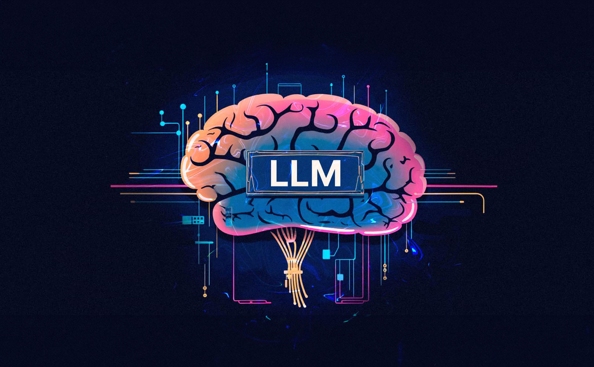
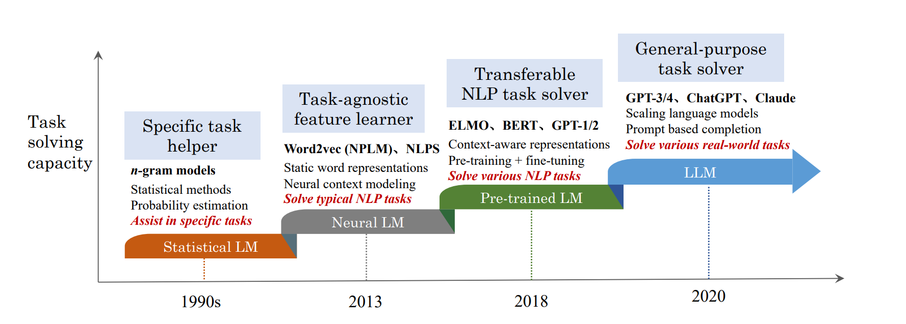
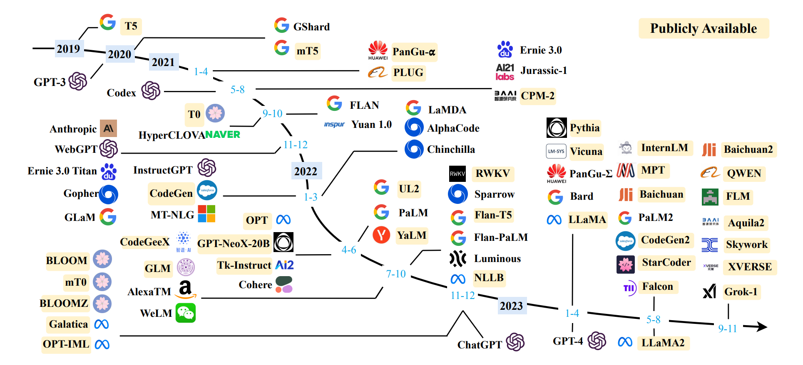
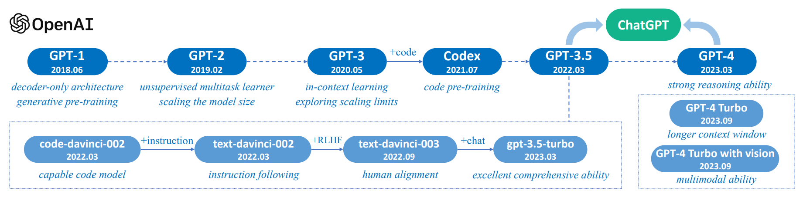
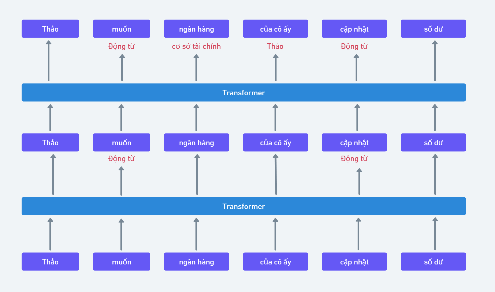
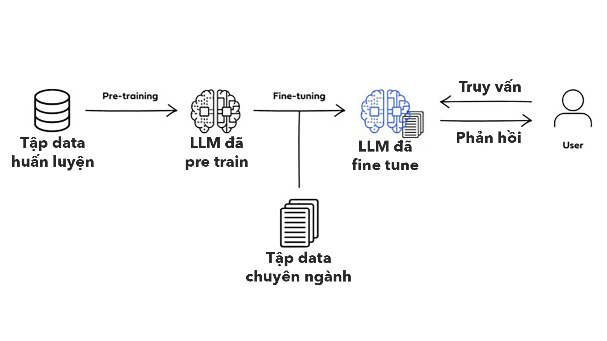
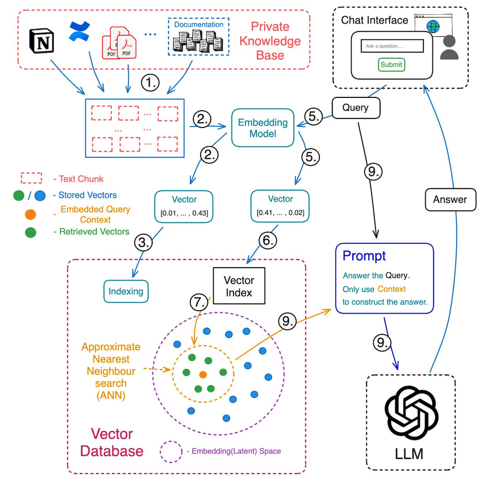
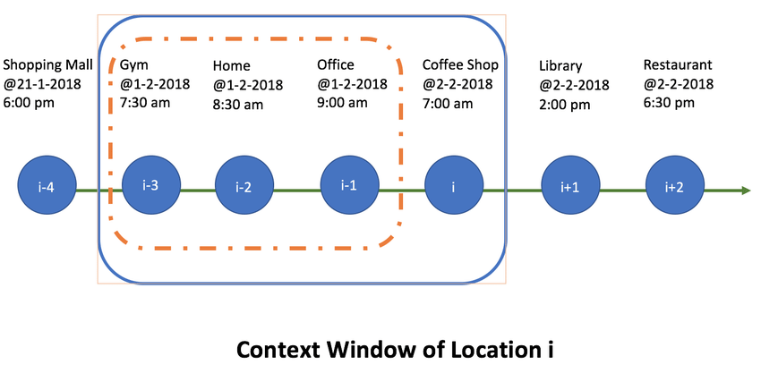

# Cùng học GenAI Phần 1: Các khái niệm cơ bản về GenAI, LLM, cách hoạt động, train, các giới hạn,...

<figure><figcaption></figcaption></figure>

### AI và Gen AI 

<figure><figcaption></figcaption></figure>

Thực ra thì khái niệm trí thông minh nhân tạo - Artificial Intelligence hay AI là không mới. Từ những năm 40 của thế kỷ trước, người ta đã đề xuất ý tưởng và thực hành đầu tiên về AI. Những chiếc máy tự động làm việc, robot, thiết bị thông minh được sinh ra với mục đích mô phỏng hành vi có suy nghĩ của con người đều tính là AI. Một trong số các AI đó chính là AI tạo sinh - Generative AI hay thường viết tắt là Gen AI. Đây chính là cái mà người ta đang nói nhiều nhất từ hơn 2 năm nay.\
\
Một thí dụ cho anh em dễ hiểu, mình thử đếm\
\
1 2 3 4 5 ...\
\
Và gần như chắc chắn khi đọc tới số 5, trong đầu của anh em sẽ nghĩ tới số 6 mặc dù mình không viết ra. Về bản chất, lúc này trong đầu chúng ta sẽ dựa vào mô hình của chuỗi số này, tự đoán ra được quy luật của nó và từ đó, dự đoán được con số tiếp theo là 6, 7,... Có thể hiểu nôm na là Gen AI là thứ công nghệ cố gắng bắt chước lại quá trình xảy ra trong đầu của con người.\
\

### [LLM](https://tinhte.vn/tag/llm) 

\
Để làm được chuyện đó, thì Gen AI hoạt động dựa trên một thứ gọi là Mô hình ngôn ngữ lớn (Large Language Model - LLM). Từ lúc được tạo ra, LLM được đánh giá là một cuộc cách mạng trong việc con người tương tác với máy tính. Hiện tại LLM đang dần định hình thế giới kỹ thuật số mới và thay đổi cách con người tương tác với máy và với nhau, thay đổi luôn cách con người học hỏi, làm việc, sáng tạo,...\

<figure><figcaption></figcaption></figure>

_Một số model LLM được public và các cột mốc phát triển của nó từ 2019_\
\
\
Những thí dụ điển hình của LLM chính là những cái tên cực kỳ nổi như GPT-4o của [OpenAI](https://tinhte.vn/tag/openai), LaMDA của Google, Anthropic, Llma của Meta,... Tất cả đều là những mô hình ngôn ngữ lớn, được các công ty này cung cấp dưới dạng API (để các dev tích hợp nó vào ứng dụng của họ), hoặc chính các công ty này cũng làm sẵn các giao diện dịch vụ cho người dùng cuối xài. Một số dịch vụ hiện tại có thể kể tới là OpenAI của [ChatGPT](https://tinhte.vn/tag/chatgpt), Google thì có Gemini, Anthropic có Claude,...\

<figure><figcaption></figcaption></figure>

LLM được tạo ra với mục đích hiểu và tạo ra ngôn ngữ con người. Người ta sử dụng các thuật toán machine learning phức tạp, các mạng neural mô phỏng cách hoạt động của não người, để xử lý và phân tích một lượng dữ liệu siêu lớn. Mục tiêu của LLM chính là hiểu được câu lệnh mà người dùng nhập vào, từ đó tạo ra một phản hồi mạch lạc, phù hợp với ngữ cảnh và cung cấp giá trị thỏa mãn nhu cầu của người dùng.\
\
Để hiểu được cách hoạt động và bản chất của LLM, chúng ta cần phải hiểu được cơ bản kiến trúc của LLM, cách người ta huấn luyện "kiến thức" của LLM.\
\

### Kiến trúc của LLM 

\
Các LLM, thí dụ như GPT 4o của OpenAI hay LaMDa của Google,... đều sử dụng một mạng neural đặc biệt là [Transformer](https://tinhte.vn/tag/transformer-3), được thiết kế đặc biệt để làm việc hiệu quả với văn bản.\

<figure><figcaption></figcaption></figure>

Để làm được điều đó, nó có một đặc tính quan trọng gọi là Self Attention. Đặc tính này cho phép nó có thể "nhìn" vào các từ khác nhau của một câu và quyết định xem từ nào là quan trọng trong ngữ cảnh cụ thể. Có thể hiểu nôm na thì Transformers cho phép model nhận định được đâu là từ quan trọng trong một câu mà người dùng nhập vào.\
\
Đặc tính quan trọng thứ 2 của Transformers chính là khả năng xác định vị trí và mã hóa. Điều này giúp Model có thể xác định được vị trí của một từ trong câu. Có thể hình dung, việc này giống như Transformers biết cách dán nhãn cho mỗi từ để model biết từ đó nằm ở đâu trong một chuỗi từ nhập vào.\
\
Với 2 đặc tính trên, LLM có thể xử lý và hiểu được không chỉ một câu mà cả một đoạn văn, một bài viết vài nghìn chữ và cả một tập tài liệu, một cuốn sách. Nó có thể hiểu ý nghĩa của các từ nằm trong một ngữ cảnh nào đó. Vì thế, khi được hỏi và hỏi đúng, model sẽ trả về ý nghĩa của từ đó và những thông tin có liên quan.\
\

### Người ta huấn luyện LLM như thế nào? 

\
Một cách ngắn gọn nhất, mục tiêu của hầu hết các đơn vị phát triển LLM hiện nay là nhồi càng nhiều kiến thức càng tốt cho nó. Bằng cách tìm mọi nguồn dữ liệu, người ta sẽ "băm" các thông tin đó ra và lưu trữ dưới dạng các vector, mỗi vector là một chuỗi các số và lưu trong một cơ sở dữ liệu vector. Chúng ta hay nghe nói model A có 9 tỷ tham số, model B có 90 tỷ tham số, thì nó chính là từ đây mà ra.\
\
Chi tiết hơn cho anh em nào muốn tìm hiểu thì quá trình train một model có thể chia ra thành 2 giai đoạn là pre-training và fine-tuning. Trải qua 2 quá trình này, LLM sẽ trở thành một giáo sư biết tuốt có kỹ năng ngôn ngữ cực đỉnh.\

<figure><figcaption></figcaption></figure>

Pre-training\
\
Ở giai đoạn này, LLM sẽ được cho tiếp xúc với lượng khổng lồ các văn bản từ sách, các bài viết, trang web, những video / ghi âm được trích lời ra và chuyển thành text,... Việc này giống như đi vào một thư viện thế giới và đọc hết sách trong đó vậy. Tất nhiên vì nó là máy nên nó đọc nhanh hơn con người rất nhiều.\
\
Sau khi review toàn bộ văn bản, LLM sao bắt đầu xác định cấu trúc của ngôn ngữ trong những văn bản đó (xác định pattern - mô hình). Kết quả của quá trình này, LLM sẽ có thể hiểu được\

* Trong một ngôn ngữ, các từ nào thường sẽ đi chung với nhau (thí dụ như Chó thì thường sẽ có liên quan tới sủa, cún con,...)
* Cấu trúc câu và ngữ pháp trong mỗi ngôn ngữ khác nhau (thí dụ như cấu trúc chủ ngữ vị ngữ, vị trí của động từ, danh từ,...)
* Một từ cụ thể sẽ liên quan tới các chủ đề nào (hiểu được chó và cún đều có liên quan tới thú cưng, động vật, huấn luyện,...)

\
Sâu hơn một chút về quá trình xử lý đống text này của LLM. Đầu tiên, toàn bộ text sẽ được "băm" ra thành những "mảnh". Thí dụ như một câu sẽ được băm ra thành những phần nhỏ gọi là các tokens. Mỗi tokens này có thể là một từ hoặc một phần của một từ hoặc một ký tự đặc biệt nào đó (thí dụ dấu chấm than, chấm hỏi,...) Sau khi băm, LLM sẽ lưu các token này dưới dạng vector. Hoạt động này được gọi là embedding hay encoding. Tất cả các vector này sẽ được lưu trữ trong một không gian database vector (anh em cứ hình dung nó như một cái nhà kho).\
\
Bản chất, các vector này chính là một cách biểu diễn toán học của token đó. Thí dụ như chữ "chó" sẽ được biểu diễn dưới dạng \[0.51, 97, 23, 45.99,....]. Nói cách khác, thay vì lưu dưới dạng text như chúng ta đang đọc, thì bây giờ nó được "dịch" sang vector chứa các số thực để máy nó cũng đọc được giống như chúng ta. Chúng ta đi học thì sẽ biết đọc, máy tính thì nó dùng các hàm số, thuật toán để "đọc".\
\
Sau khi Embedding, LLM sẽ "hiểu" được ý nghỉa của từng token dựa trên những pattern mà nó đã học trước đó. Do mỗi token đều được đại diện bằng các con số trong chuỗi số chưa trong vector, nên người ta sẽ có các phép toán để đo lường "độ gần nhau" của các vector, đại khái vậy là các mà LLM hiểu được ý nghĩa của các vector. Từ đó, những vector của các token có "nghĩa" tương tự nhau, cùng một nhóm chủ đề,... sẽ được "sắp xếp" ở gần nhau trong không gian vector.\
\
Thí dụ cho dễ hiểu, chữ "chó" sẽ được embedding thành thí dụ như \[48, 49, 51, 15, 91, 36, 63, 10.1,...], còn chữ "cún" sẽ được embedding thành \[48, 49, 51, 15, 91, 36, 63, 10.2,...]. Anh em có thể thấy đoạn đầu của 2 vector này giống nhau ha, LLM sẽ sắp nó ở gần nhau và sẽ hiểu là ngữ cảnh xài 2 từ này cũng sẽ có liên quan nhau. Việc số chính xác trong từng vector ra sao, rồi phép tính ra sao thì quá chuyên sâu rồi, không phù hợp ở đây.\
\
\
Fine-tuning\
\
Sau giai đoạn Pre Training, LLM sẽ được chuyển sang giai đoạn Fine tuning - tinh chỉnh. Tới đây, LLM sẽ được đào tạo bổ sung bằng các bộ dữ liệu nhỏ hơn có liên quan tới các tác vụ cụ thể. Anh em cứ hình dung là giai đoạn đầu LLM sẽ học hết lớp 12, tới giai đoạn này thì nó vào đại học học chuyên ngành.\
\
Cụ thể, trong giai đoạn Fine tuning, LLM sẽ được cho chạy thử những task cụ thể để tạo ra kết quả dựa trên những dữ liệu mẫu đã được gắn nhãn. Các dữ liệu mẫu này đã được gắn nhãn, chia thành những chỉ mục, được diễn tả sẵn nội dung. Nôm na thì ở đây, người ta sẽ cho model biết đầu ra là cái gì và yêu cầu nó chạy sao cho ra như vậy thì mới đúng.\
\
Việc pre training và fine tuning đều nhằm dạy cho LLM nhận biết được pattern của dữ liệu. Sau này, khi gặp một câu lệnh, nó sẽ dựa vào pattern đã học được để hiểu câu lệnh này, sau đó tạo ra câu trả lời tương ứng. Tới đây thì chúng ta có thể thấy, mặc dù model AI không thực sự hiểu ngôn ngữ con người, nhưng bằng cách dạy cho nó "ngôn ngữ đã được chuyển về số", model sẽ có thể xác định được pattern, từ đó bắt chước được phản ứng ngôn ngữ của con người.\
\
Trên đây chính là cách mà một LLM học và xử lý ngôn ngữ con người. Nó không chỉ có thể áp dụng trong chatbot vấn đáp, mà còn có thể phân tích được tình cảm, nhận diện chủ đề, phân loại tài liệu,... tất cả đều dựa trên thuật toán xác định mức độ liên quan của các vector đại diện cho từ, cụm từ,...\
\

### Những thứ diễn ra đằng sau khi người dùng chat với chatbot LLM 

<figure><figcaption></figcaption></figure>

Khi người dùng vào một ứng dụng chatbot tải một tài liệu lên, sau đó gõ câu lệnh cho LLM > LLM trả về kết quả, đằng sau đó là một loạt những thứ xảy ra, bên dưới đây là những thứ cơ bản.\
\
Bước 1: Cấu trúc dữ liệu của người dùng đưa vào\
Lúc này model sẽ "bẻ" toàn bộ các tài liệu ra thành những miếng nhỏ hơn, dễ quản lý hơn. Sau khi băm nhỏ, các miếng nhỏ này sẽ đại diện cho những phần nào đó của thông tin có thể truy vấn được.\
\
Bước 2: Embedding\
Chuyển đổi các miếng văn bản thành dạng vector. Trong quá trình embedding này, model sẽ nắm bắt được bản chất của thông tin, quy luật chứa trong đó và mã hóa nó thành một chuỗi số, lưu trong một cái \[0,0334, 4205,...] gọi là các vector để có thể truy vấn bằng thuật toán.\
\
Bước 3: Lưu trữ các vector\
Tất cả các vector sẽ được model nhúng vào cơ sở dữ liệu vector của cả model. Đây chính là bộ não của model.\
\
Bước 4: Lưu trữ các văn bản gốc\
Bước này đảm bảo các văn bản gốc tương ứng với các vector đã embedding ở bước trên được lưu trữ, để dành để cần truy xuất khi muốn lấy thông tin có liên quan trong quá trình người dùng truy vấn bằng prompt.\
\
Bước 5: Embedding câu hỏi (prompt) của người dùng\
Người dùng nhập câu truy vấn vào chatbot, câu truy vấn đó cũng sẽ được embedding thành các vector.\
\
Bước 6: Truy vấn\
Một thuật toán được chạy để mang các vector prompt đi tìm trong cơ sở dữ liệu vector. LLM sẽ xác định số lượng vector ngữ cảnh mà người dùng muốn truy xuất, tìm kiếm các thông tin có liên quan để tìm ra câu trả lời.\
\
Bước 7: Truy xuất các vector tương tự\
LLM sẽ chạy một cái gọi là ANN - Tìm kiếm lân cận gần đúng trong cơ sở dữ liệu vector để tìm các vector trong khi gần nhất với vector trong prompt. Truy xuất vào lượng vector ngữ cảnh đã xác định trước đó.\
\
Bước 8: Ánh xạ các vector thành các đoạn văn bản\
LLM sẽ liên kết các vector đã truy xuất ra trong kho với các đoạn văn bản tương ứng. Nói cách khác, bước này là chuyển các vector thành văn bản tương ứng mà nó đại diện.\
Bước 9: Hoàn tất câu trả lời\
\
Ở công đoạn cuối, LLM sẽ chuyển các mọi thứ tìm thấy được, lắp ráp lại thành câu trả lời và hiện ra cho người dùng. Đối với chatbot, một đoạn văn bản sẽ được trả về trong giao diện người dùng, hiện ra ra như 2 người đang chat qua lại với nhau.\
\
Context windows

<figure><figcaption></figcaption></figure>

Đây là khái niệm quan trọng và cũng thường gặp khi người ta nói về một model AI, so sánh model này với model kia. Context windows chính là số lượng text mà một model có thể xử lý cùng lúc. Con số này càng lớn, hàm lượng, chiều sâu của thông tin và các mối liên hệ giữa chúng sẽ được tìm ra nhiều hơn.\
\
Vai trò của chỉ số Context windows đối với một model:\

* Tính mạch lạc và mức độ liên quan: [Context window](https://tinhte.vn/tag/context-window) càng lớn thì luồng hội thoại của LLM với người dùng càng mạch lạc, phù hợp với ngữ cảnh. Đặc biệt khi yêu cầu LLM phân tích tài liệu, Context window càng lớn thì mạch nội dung của tài liệu được thể hiện rõ ràng, thích hợp hơn khi người dùng truy vấn.
* Tạo và hiệu chỉnh văn bản hiệu quả hơn: Đối với các tác vụ tạo bài viết, câu chuyện hoặc tạo code, Context window càng lớn cho phép người dùng liên tục hiệu chỉnh cái mà model đã tạo ra trước đó được hiệu quả hơn, bám sát nội dung hơn. Thí dụ như trước đó yêu cầu model viết một đoạn văn, model trả về kết quả, chúng ta lại yêu cầu model sửa kết quả đó cho đúng ý, thì context window lớn sẽ làm chuyện này hiệu quả hơn.
* Chất lượng của cuộc trò chuyện: khi dùng model để làm chatbot, Context Window lớn thì khả năng AI nhớ và tham khảo lại các nội dung nói chuyện trước đó được hiệu quả hơn, từ đó sự tương tác qua lại giữa người dùng và model được hấp dẫn và tự nhiên hơn.
* Khả năng truy xuất kiến thức: Đối với các tác vụ yêu cầu phải tham chiếu từ một nguồn tài liệu lớn hoặc các kiến thức nằm rải rác trong một tài liệu dài, Context Window càng lớn thì model càng tham chiếu chéo và tổng hợp thông tin càng hiệu quả.

\
Tuy nhiên, Context window quá lớn cũng dẫn tới việc cần nhiều tài nguyên tính toán và tốn nhiều bộ nhớ hơn. Hệ quả là các phản hồi sẽ được trả về chậm và cũng hao tài nguyên hơn, mà hao tài nguyên thì hao tiền. Hiện tại thì đây cũng chính là điểm mà các nhà phát triển LLM đang liên tục tìm cách cải thiện nhằm vừa đảm bảo khả năng thích ứng của model trong các tác vụ phức tạp nhưng vẫn đảm bảo hiệu quả hoạt động.\
\
Ở thời điểm hiện tại, GPT-4o đang có Context Window là 128.000 token, Gemini 1.5-flash và Gemini 1.5-Pro là 1 triệu Token, Claude-4-hyaiku và Claude-3-sonnet là 200.000 token. Có thông tin nói rằng trong tiếng Anh, thì trung bình 1000 token tương ứng với khoảng 750 từ. Đối với tiếng Việt, do cấu trúc phức tạp hơn nên có thể con số từ tương ứng với 1000 token có thể còn thấp hơn nữa. Tuy nhiên đáng mừng là dù sao tiếng Việt vẫn được xây dựng dựa trên ký tự Alphabet nên chúng ta về cơ bản có thuận lợi hơn so với những nước sử dụng ký tự phi La tinh.\
\

### Hạn chế của LLM 

<figure><figcaption></figcaption></figure>

Mặc dù tới hiện tại, các LLM đã chứng minh được sức mạnh, sự hiệu quả của nó trong việc tạo ra các phản hồi bắt chước con người, từ đó ứng dụng cho rất nhiều các tác vụ khác nhau nhằm tiết kiệm thời gian làm việc chuyên môn. Tuy nhiên các model vẫn tồn tại những thách thức và giới hạn cố hữu của nó.\
\
Cụ thể:\
Độ chi tiết: LLM thường có xu hướng tạo ra các phản hồi dài dòng, thường chứa nhiều thông tin hơn mức cần thiết hoặc tạo ra các ý tưởng bị trùng lặp. Lúc này đòi hỏi người dùng phải yêu cầu model rõ ngay từ đầu là tạo ra phản hồi ngắn gọn hoặc những ràng buộc phù hợp, đồng thời sau đó cần phải yêu cầu model chỉnh sửa câu trả lời cho tới khi có được kết quả đúng ý nhất.\
\
Sự mơ hồ: LLM có thể sẽ khó làm việc khi người dùng đưa các prompt không rõ ràng hoặc có tính nhất quán kém, dẫn tới kết quả đầu ra không có nhiều giá trị đối với người dùng. Lúc này, người dùng cần đầu tư thời gian và công sức nhiều hơn để đưa ra các prompt rõ ràng, cụ thể, nhất quán, miêu tả đầy đủ kết quả mong muốn và cung cấp dữ liệu đầu vào nếu cần để giảm thiểu sự mơ hồ trong prompt.\
\
Tính thiếu nhất quán: LLM đôi khi sẽ tạo ra những phản hồi chưa những thông tin mâu thuẫn hoặc các phản hồi ở những lần chạy khác nhau có chất lượng không đồng đều. Để đảm bảo tính nhất quán của kết quả đầu ra, người dùng cần điều chỉnh các tham số và vận dụng các kỹ thuật prompt khi cần thiết để đạt được kết quả mong muốn.\
\
Thiếu nhận thức: Mặc dù LLM có lượng kiến thức rất lớn, nhưng đôi khi nó lại đưa ra những câu trả lời thể hiện sự thiếu nhận thức về cuộc sống ngoài đời thật hoặc đưa ra các giả định không thích hợp. Lúc này người dùng cần thử nghiệm các cách prompt khác nhau để loại bỏ điều này, tạo ra những phản hồi chính xác và xác thực hơn.\
\
Thiên vị: đây là một hệ quả từ chính sự "chưa đầy đủ" trong tập dữ liệu huấn luyện model ban đầu, từ đó khiến cho model bị thành kiến, thiên vị. Điều này có thể dẫn tới những sự sai lệch hoặc phân biệt đối xử ẩn chứa trong các câu trả lời. Đây là một vấn đề khá nghiêm trọng và có thể ảnh hưởng tới kết quả khi dùng LLM trong một số lĩnh vực như tuyển dụng, giáo dục và ra quyết định. Do đó, cần nhận thức rõ sự tồn tại của tính thiên vị và kiểm tra lại các kết quả đầu ra đối với những lĩnh vực mang tính quan trọng.\
\
Làm toán: do bản chất data đào tạo nên khả năng thực hiện các phép toán của model LLM là có hạn chế. Ngoài ra vẫn có thể tồn tại những bài toán logic mà model chưa được học. Tuy nhiên do bản chất hoạt động, LLM có thể vẫn sẽ tạo ra phản hồi nhưng trong đó là kết quả sai. Do đó cần thận trọng khi sử dụng các LLM trong các lĩnh vực đòi hỏi tính chính xác tuyệt đối như tài chính, ra quyết định,...\
\
Hallucianation - ảo giác: Đây là một vấn đề được đề cập tới rất nhiều khi nói tới các LLM và cũng là cái mà các nhà phát triển đang tìm cách giải quyết. Ảo giác AI là hiện tượng mà LLM sẽ tạo ra các văn bản không chính xác về mặt thực tế, vô nghĩa hoặc không liên quan tới ngữ cảnh trong prompt ban đầu nhưng lại được ẩn chứa trong một đoạn văn bản có vẻ rất hợp lý.\
\
Nguyên nhân một phần là do lượng dữ liệu huấn luyện model vẫn mang tính giai đoạn, phần còn lại là do LLM dù học và liên kết các dữ liệu rất lớn, nhưng nó vẫn là máy và do đó, nó không hiểu biết nội tại của thế giới thật, cũng không có khả năng suy luận như con người. Kết quả là phản hồi của nó có thể sẽ có vẻ rất hợp lý nhưng không chính xác hoặc phi logic.\
\
Ảo giác thường xảy ra khi người dùng hỏi các thông tin thực tế ngoài đời, những thông tin thời sự hoặc những yêu cầu đưa ra quyết định. Để giảm thiểu tác động của ảo giác, người dùng buộc phải nhận thức rõ giới hạn nguy hiểm này của LLM, đồng thời phải tối ưu tùy biến các model để phục vụ nhu cầu đặc thù của người dùng, đồng thời phải hỏi lại, dùng các kỹ thuật bắt model tự đánh giá kết quả, để nâng cao hiệu suất và độ tin cậy của kết quả đầu ra.\
\

### Tạm kết phần 1 

\
Tới đây, chúng ta đã đi qua được những thứ cơ bản nhất về AI, Gen AI, LLM, rồi cách train một LLM, cách một LLM chạy khi chúng ta đặt câu hỏi, những thông số quan trọng khi người ta đi nói về LLM và cả những giới hạn ở hiện tại của nó. Bài 1 đã dài quá rồi, ở các bài tiếp theo, mình sẽ cùng với anh em đi sâu hơn về prompt, cách viết prompt từ cơ bản nhất tới tiên tiến nhất hiện tại mà người ta nghiên cứu ra được để nhờ LLM làm được nhiều việc hơn, từ các truy vấn cơ bản để tìm thông tin nhanh hơn, nhờ LLM xử lý hàng loạt các tác vụ nào đó, phân tích số liệu với LLM, rồi cả những used case cụ thể,… nhiều lắm, hẹn anh em ở bài sau, giờ này mà ngày mai nha.

From: [Tinhte.vn](https://tinhte.vn/thread/cung-hoc-genai-phan-1-cac-khai-niem-co-ban-ve-genai-llm-cach-hoat-dong-train-cac-gioi-han.3801144/)
